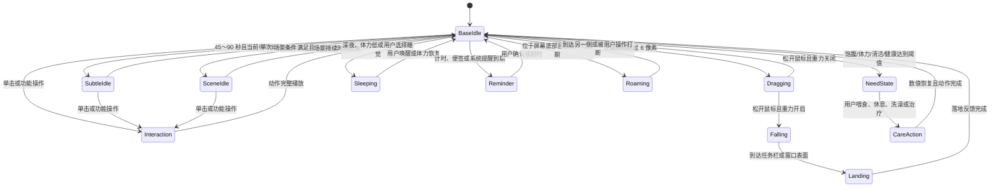
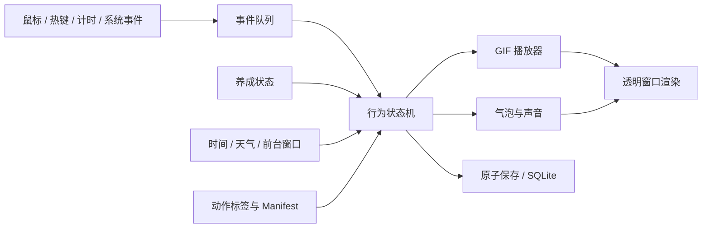

# 线条小狗桌宠完整版功能设计

> 设计依据：`desktop_pet_design_spec.md`、`..\catalog\gif_action_catalog.csv`、`..\catalog\gif_action_catalog.json`。  
> 目标平台：Windows 10 / Windows 11。  
> 表现形式：2D 透明 GIF，不使用 3D 模型。

## 一、产品目标

完整版不是单纯播放 GIF 的贴图程序，而是一只具有持续自然动作、桌面物理行为、养成状态、日常工具和可选智能对话能力的桌面宠物。

必须满足以下原则：

1. 主角色默认始终为白色线条小狗，不在普通待机中突然换成黄色角色。
2. 桌宠每时每刻都有轻微动作，但不得通过整体上下漂浮制造“运动感”。
3. 动作变化由状态和场景触发，不高频随机乱切。
4. 所有 GIF 切换必须发生在完整循环边界；一次性动作必须播完再返回待机。
5. 桌宠窗口透明、无边框、可拖动、可缩放，可直接双击单个 EXE 运行。
6. 离线功能不依赖网络；天气和 AI 仅在用户主动配置后联网。
7. 所有养成数据、便签、设置和对话记忆均保存在本机，并允许备份、恢复和删除。

## 二、角色与素材体系

### 2.1 角色分层

| 层级 | 角色 | 使用规则 |
| :--- | :--- | :--- |
| 默认主角 | 白色小狗 | 基础待机、移动、点击互动、睡眠、进食、工作和状态反馈均优先使用 |
| 可选皮肤 | 黄色垂耳狗、黄色立耳狗 | 用户主动切换后使用，不与白色主角在普通动作中混播 |
| 伙伴事件 | 白色加黄色双宠、大小双狗 | 通过好感度、节日或特定互动解锁，仅作为完整事件播放 |
| 排除素材 | `AD01`、`AD02` | 宣传图片，程序不得载入 |

### 2.2 动作资源包结构

程序不根据文件名猜测动作，而是读取 `..\catalog\gif_action_catalog.json` 中的标签。运行时再生成根目录中的 `..\action_manifest.json`，记录状态名、GIF 编号、循环方式、冷却时间和解锁条件。

建议资源包结构：

```text
pet_assets/
├─ white/          # 默认白色小狗
├─ yellow_floppy/  # 黄色垂耳皮肤
├─ yellow_upright/ # 黄色立耳皮肤
├─ companion/      # 双宠与幼崽事件
├─ seasonal/       # 生日、新年和装扮
├─ effects/        # 雨、雪、气泡等程序绘制效果
└─ sounds/         # 可选 WAV 音效
```

### 2.3 完整版核心动作映射

| 功能状态 | 首选 GIF 编号 | 备用或扩展编号 | 播放规则 |
| :--- | :--- | :--- | :--- |
| 基础呼吸 | `119` | `116`、`123`、`130` | 循环播放；只做轻微呼吸、歪头或踏步 |
| 安静休息 | `094` | `117` | 连续工作一段时间后低频进入 |
| 转身观察 | `101` | `132` | 单次播放，完整结束后回基础呼吸 |
| 屏幕边缘探头 | `103` | 无 | 灰墙贴合屏幕边缘；右边缘用原图，左边缘镜像；`105` 花盆躲藏保留为普通场景待机 |
| 坐姿场景 | `007` | `143`、`149`、`002` | 每次保持 20～90 秒，不连续更换道具 |
| 挥手 | `018` | `017`、`031` | 单击或通知确认时单次播放 |
| 压扁回弹 | `004` | `108`、`113` | 点击或落地时单次播放 |
| 受惊 | `042` | `029`、`092` | 快速点击、系统告警或突然唤回时触发 |
| 翻滚恢复 | `127` | `107`、`135` | 拖拽坠落或强互动后播放 |
| 抚摸开心 | `134` | `020`、`089`、`200` | 提升心情和好感度 |
| 爱心反馈 | `032` | `033`、`038`、`039`、`054`、`055`、`061`、`090`、`126` | 根据好感等级逐步解锁，使用不重复随机袋 |
| 随机横向巡游 | `001`、`046`、`052`、`053`、`080`、`086`、`097`、`182` | 无 | 包含开车、贴地翻滚、双宠奔跑、趴地蠕动和骑马；按素材原始朝向和实际移动方向决定是否水平镜像 |
| 低速移动 | `086` | 无 | 趴地蠕动使用最低移动速度 |
| 特殊移动 | `166` | `115` | 高等级或节日时极低频触发 |
| 被拎起/悬空 | `109` | `110`、`127` | 拖动超过阈值后循环或分段播放 |
| 落地反馈 | `113` | `004`、`135` | 根据下落速度选择轻落地或重落地 |
| 困倦 | `118` | `199` | 体力低或深夜触发 |
| 正常睡眠 | `160` | 无 | `199` 打哈欠完成后进入双宠拥抱睡眠循环；`035` 是泪流满地，`097` 是贴地翻滚 |
| 生病卧床 | `150` | `003`、`095` | 健康值过低时触发，不与普通睡眠混用 |
| 进食准备 | `088` | `147` | 喂食时先端菜，再完整播放吃饭 |
| 冰淇淋 | `162` | 无 | 高心情、低饱腹奖励，并轻微降低健康和清洁 |
| 洗澡清洁 | `019` | `158` | 清洁度低时先脏污反馈，再播放洗澡 |
| 工作陪伴 | `148` | `002`、`044` | 番茄钟工作阶段使用 |
| 音乐娱乐 | `040` | `034`、`125`、`180` | 用户选择娱乐或心情恢复时使用 |
| 消息提醒 | `138` | `031`、`017`、`152` | 计时完成、便签或系统提醒时使用 |
| 大风天气 | `110` | 无 | 天气模块确认大风时播放，并增加风线效果 |
| 生日事件 | `045` | `059`、`151` | 用户生日当天使用 |
| 新年事件 | `178` | 无 | 日期满足节日规则时使用 |
| 伙伴依偎 | `048` | `096`、`112`、`161` | 好感等级达到要求后解锁 |
| 伙伴互动 | `047` | `051`、`080`、`141`、`154`、`160` | 每次完整播放一个事件，不拆开切换 |
| 幼崽事件 | `128` | `157` | 高等级隐藏事件 |

### 2.4 黄色皮肤动作对应

黄色皮肤使用动作语义配对，不直接给白色 GIF 染色。主要对应关系如下：

| 语义 | 白色主角 | 黄色皮肤 |
| :--- | :--- | :--- |
| 洗澡 | `019` | `022` |
| 哭泣 | `095` 或 `131` | `066` |
| 睡觉 | `160` | `071` 或 `085` |
| 电话提醒 | `138` | `139` |
| 冰淇淋 | `162` | `163` |
| 滑板车 | `166` | `167` |
| 吉他 | `180` | `181` |
| 礼盒 | `059` | `060` |
| 新年红包 | `178` | `177` |

没有语义配对的动作在该皮肤下不触发，不能临时切回白色角色。

## 三、行为状态机

### 3.1 状态优先级

动作调度器每帧只允许一个主状态控制角色。优先级从高到低为：

1. 程序退出、数据保存和错误恢复。
2. 用户拖拽、菜单操作、鼠标穿透热键和窗口召回。
3. 用户主动互动：点击、选择食物，或选择带时长的运动、工作、游戏，以及洗澡、休息。
4. 计时完成、低电量、高资源占用等重要提醒。
5. 生病、极低饱腹度、极低体力等养成状态。
6. 睡眠、工作陪伴、天气和节日场景。
7. 低频特殊待机。
8. 基础呼吸待机。

高优先级动作可以等待低优先级 GIF 当前循环结束，但不得被低优先级动作覆盖。拖拽属于即时操作，可以中断普通待机；被中断动作必须重置，不能从中间帧恢复。

### 3.2 主状态流转



### 3.3 自然待机调度

完整版取消“每几十秒明显换一个大动作”的做法，改为三层节奏和独立巡游层：

| 层级 | 时间尺度 | 动作 | 规则 |
| :--- | :--- | :--- | :--- |
| 微动作层 | 持续 | `119`、`116`、`123` | 每时每刻在动，但动作幅度小，不移动窗口 |
| 姿态层 | 45～90 秒 | `101`、`130`、`134` | 每次完整播放 2 遍，使持续时间变为上一版的 2 倍；同一编号至少 8 分钟内不重复 |
| 场景层 | 每 4～12 分钟触发，单次持续 50～150 秒 | `007`、`105`、`143`、`149`、`002` | 有道具或明显情节；持续时间为上一版的 2 倍，不与其他场景连播 |
| 巡游层 | 3～7 分钟 | `001`、`046`、`052`、`053`、`080`、`086`、`097`、`182` | 只在桌面底部和用户无操作时触发；移动到另一侧后回到基础待机，各动作使用不同速度 |

补充约束：

- 用户刚操作后的 20 秒内不触发主动场景。
- 两个明显特殊动作之间至少间隔 3 分钟。
- 使用“洗牌袋”选择动作：同一动作池全部使用一遍前不重复。
- 当前窗口在全屏游戏或演示时，停止主动场景和气泡，只保留最低刷新或自动隐藏。
- 桌宠窗口本身不得周期性上下移动；角色落地感由 GIF 原始姿态决定。
- 巡游只允许水平移动，不增加漂浮或周期性上下位移；位于普通窗口顶端或悬空时延后触发。

## 四、鼠标、键盘与窗口交互

### 4.1 鼠标操作

| 操作 | 行为 |
| :--- | :--- |
| 左键单击 | 从已解锁互动池中使用不重复随机袋选择动作，并显示对应气泡 |
| 左键双击 | 打开完整版控制面板；第一次单击延迟最多 320 毫秒确认，避免同时触发互动 |
| 左键长按拖动 | 进入被拎起状态；移动超过 6 像素后才算拖拽，避免误触 |
| 松开左键 | 根据重力、窗口碰撞和边缘吸附设置决定下落或停留 |
| 鼠标悬停 | 在角色上方显示紧凑状态卡；互动栏按吃饭、运动、工作、游戏、工具分类，右侧空间不足时自动换到左侧，状态卡和多级菜单不得超出当前显示器 |
| 鼠标滚轮 | 默认缩放角色，范围 50%～200%；按住 `Ctrl` 滚轮调整音量 |
| 右键 | 打开角色配置与物理开关菜单，不放置喂食等照顾操作 |

点击命中使用当前帧 Alpha 像素检测。透明区域不得触发角色动作，也不得无故拦截下方窗口操作。

### 4.2 全局快捷键

| 快捷键 | 功能 |
| :--- | :--- |
| `Ctrl + Alt + D` | 显示或隐藏桌宠；隐藏时仍保留计时提醒 |
| `Ctrl + Alt + T` | 开启或关闭鼠标穿透 |
| `Ctrl + Alt + P` | 将桌宠召回主显示器右下角并临时置顶 |
| `Ctrl + Alt + Space` | 暂停或恢复主动动作与气泡 |

快捷键允许在设置中修改。检测到冲突时必须提示并恢复原快捷键，不能静默失效。

### 4.3 置顶与桌面层级

- 强力置顶开启时，每 2 秒校验一次 `WS_EX_TOPMOST`，恢复层级时使用 `SWP_NOACTIVATE`，不得抢键盘焦点。
- 跟随桌面模式关闭置顶，但仍保持工具窗口，不在任务栏产生普通按钮。
- UAC、安全桌面、独占全屏和其他置顶窗口不保证覆盖。
- 重复启动 EXE 时只保留一个实例，并尝试显示已有窗口。

### 4.4 鼠标穿透

开启穿透后添加 `WS_EX_TRANSPARENT`，桌宠不接收鼠标事件。必须同时保留全局热键 `Ctrl + Alt + T` 和托盘菜单恢复入口，避免用户无法关闭穿透。

## 五、拖拽物理、边缘与窗口碰撞

### 5.1 拖拽与下落

1. 按下角色后记录光标和窗口偏移。
2. 移动距离达到 6 像素后进入 `Dragging`，播放 `109` 或 `127`。
3. 松手后计算垂直速度。重力开启时：

```text
v(t + Δt) = min(v(t) + g × Δt, v_max)
y(t + Δt) = y(t) + v(t + Δt) × Δt
```

其中 `g = 1800 px/s²`，`v_max = 1600 px/s`。每帧必须用实际 `Δt` 计算，不能假设固定帧率。

4. 落差小于 80 像素时播放轻落地 `004`；落差达到 80 像素时播放 `113`；高速落地播放 `135`。
5. 落地动作完成后返回 `119`，不得继续上下弹跳。

### 5.2 碰撞表面

可站立表面按以下顺序选择：

1. 当前光标下方可见普通窗口的顶部边缘。
2. 当前显示器工作区底部，即任务栏上方。
3. 用户关闭窗口碰撞时，保持松手位置。

需要排除桌宠自身窗口、桌面窗口、任务栏、隐藏窗口、最小化窗口和小于 100×60 像素的工具窗口。被站立窗口移动、最小化或关闭后，桌宠重新下落到下一表面。

### 5.3 边缘吸附

- 距离显示器左右边缘 32 像素内时吸附。
- 3 秒无操作后切换为 `103`“白狗墙后探头”；不再把整个窗口推出屏幕。
- 原图墙在右侧，因此右边缘使用原图；左边缘对 GIF 水平镜像。
- 对话气泡出现、计时到期或用户拖动时立即完全显示。
- 多显示器使用各自工作区，保存位置失效时移动到最近显示器可见区域。

## 六、气泡、文字与声音

### 6.1 对话气泡

- 气泡优先显示在角色上方；空间不足时显示在左侧或右侧，绝不覆盖角色主体。
- 中文按字符宽度自动换行，最多 4 行；超过 80 个字符显示摘要，完整内容进入对话面板。
- 普通短句使用每秒 16～22 字的打字机效果。
- 点击互动停留 2.5～4 秒，工具提醒停留到用户确认或最多 20 秒。
- 相同句子 30 分钟内不重复；主动气泡之间至少间隔 45 分钟。

### 6.2 对话类型

| 场景 | 示例 |
| :--- | :--- |
| 普通点击 | “看到你啦！”、“今天也一起加油。” |
| 饥饿 | “肚子有一点空啦……” |
| 困倦 | “我想打个小盹。” |
| 计时完成 | “这一轮完成，休息一下吧！” |
| 天气 | “外面风有点大，出门注意呀。” |
| 系统告警 | “内存有点紧张，我先安静待着。” |

### 6.3 声音

- 音效和语音分为两个独立开关。
- 若 `sounds/<action>.wav` 存在则播放；不存在时静默，不用刺耳系统蜂鸣代替。
- 音量范围 0～100%，默认 35%。
- 夜间 23:00～07:00 默认启用安静时段，除闹钟外不自动播放声音。

## 七、养成与成长系统

### 7.1 数值

| 数值 | 范围 | 初始值 | 主要变化 |
| :--- | :--- | :--- | :--- |
| 饱腹度 `fullness` | 0～100 | 80 | 随时间降低；营养餐、冰淇淋恢复量不同 |
| 心情值 `mood` | 0～100 | 75 | 忽视时缓慢降低；游戏、摸摸互动、运动和音乐恢复 |
| 体力值 `energy` | 0～100 | 80 | 清醒时极慢降低，运动、工作和游戏按时长降低；吃饭、休息和睡眠恢复 |
| 清洁度 `cleanliness` | 0～100 | 85 | 随时间和活动降低；洗澡恢复 |
| 健康值 `health` | 0～100 | 100 | 长期饥饿、疲劳或脏污时降低；正常照顾后缓慢恢复 |
| 好感度 `affection` | 0～1000 | 0 | 有冷却的有效互动增加，不随时间倒扣 |
| 经验值 `xp` | 非负整数 | 0 | 完成照顾、番茄钟和日常任务获得 |

### 7.2 时间结算

自然状态默认每 10 分钟统一结算一次；吃饭、运动、工作和游戏等用户操作立即生效，其中持续活动的数值按所选分钟数成比例计算。离线补算最多 72 小时，防止长时间未启动后数值直接归零。令：

```text
Δt_h = min((当前时间 - 上次结算时间) / 3600, 72)
fullness_new = clamp(fullness_old - 2.4 × Δt_h, 0, 100)
cleanliness_new = clamp(cleanliness_old - 0.9 × Δt_h, 0, 100)
```

体力根据状态结算：

```text
清醒：energy_new = clamp(energy_old - 0.2 × Δt_h, 0, 100)
睡眠：energy_new = clamp(energy_old + 12 × Δt_h, 0, 100)
```

心情每小时基础降低 0.5，单次离线补算最多降低 16 点。健康惩罚只在需求值低于阈值时发生：

```text
penalty = 0
if fullness < 15: penalty += 1.6 × Δt_h
if energy < 10: penalty += 1.2 × Δt_h
if cleanliness < 10: penalty += 0.8 × Δt_h
health_new = clamp(health_old - penalty, 0, 100)
```

### 7.3 阈值与动作

| 条件 | 表现 | GIF |
| :--- | :--- | :--- |
| 饱腹度 20～39 | 偶尔提示饿，不中断用户 | `120` 或气泡 |
| 饱腹度低于 20 | 停止高强度跑动并请求喂食 | `120` |
| 心情低于 30 | 减少主动互动 | `095`、`131` |
| 体力低于 25 | 打哈欠和点头 | `199`、`118` |
| 体力低于 10 | 自动请求休息 | `199` 后转 `160` |
| 清洁度低于 25 | 出现脏污状态 | `158` |
| 健康低于 35 | 进入生病模式 | `150` |

负面状态提示有 30 分钟冷却，不能不断弹气泡催促用户。

### 7.4 照顾操作

| 操作 | 数值效果 | 动作 |
| :--- | :--- | :--- |
| 营养餐 | 饱腹 +35、体力 +12、健康 +3、心情 +2、经验 +4 | `088` → `147` |
| 冰淇淋 | 饱腹 +10、体力 +4、心情 +14、健康 -2、清洁 -3、经验 +2 | `162` 连播三次 |
| 热身弹跳（15 分钟基准） | 心情 +4、健康 +2、体力 -6、饱腹 -2、清洁 -1、经验 +2 | `108` 循环 |
| 啦啦操（15 分钟基准） | 心情 +10、健康 +3、体力 -14、饱腹 -4、清洁 -2、好感 +2、经验 +3 | `030` 循环 |
| 跑步（15 分钟基准） | 心情 +7、健康 +5、体力 -28、饱腹 -6、清洁 -5、好感 +2、经验 +4 | `179` 循环 |
| 写笔记 / 电脑办公 / 上班中（30 分钟基准） | 分别消耗体力并获得 4 / 6 / 8 经验 | `002` / `115` / `148` 循环 |
| 摸摸互动 / 手柄游戏 / 一起说相声（15 分钟基准） | 增加心情或好感，同时少量消耗体力 | `134` / `149` / `164` 循环 |
| 洗澡 | 清洁度 +55、心情按偏好 ±3、经验 +3 | `158` → `019` |
| 小睡 | 每分钟体力 +0.2 | `160` |
| 治疗 | 健康低于 60 时可用；健康 +25 | `150` 完整播放后恢复 |

运动和游戏可选 5/15/30 分钟，工作可选 15/30/60 分钟；上表为基准时长效果，实际数值按时长比例计算。用户仍可在“控制面板 → 外观与行为 → 养成参数”修改自然消耗和运动体力倍率。

同类操作共享冷却，活动进行中不能重复启动另一项同类持续活动。

### 7.5 等级与解锁

等级计算采用逐级经验表，不使用不透明公式：

| 等级 | 累计经验 | 解锁内容 |
| :--- | ---: | :--- |
| 1 | 0 | 基础待机、4 个点击互动、正餐和休息 |
| 2 | 100 | 音乐动作 `040`、`125` |
| 3 | 260 | 场景待机 `105`、`149` |
| 4 | 520 | 爱心动作池和黄色皮肤 |
| 5 | 900 | 伙伴依偎 `048`、`112` |
| 6 | 1400 | 双宠互动 `047`、`141`、`154` |
| 7 | 2100 | 特殊移动 `115`、`166` |
| 8 | 3000 | 幼崽事件 `128`、`157` |
| 9 | 4200 | 节日与隐藏对话扩展 |
| 10 | 5600 | 全动作自由选择，不再增加数值强度 |

等级仅解锁表现，不销售数值、不设置付费点。

## 八、时间、天气与环境感知

### 8.1 昼夜行为

| 时间 | 默认行为 |
| :--- | :--- |
| 05:00～10:59 | 早安气泡一次，使用 `089` 或 `199` 后恢复待机 |
| 11:00～13:59 | 午餐提示最多一次，可使用 `088` |
| 14:00～18:59 | 工作陪伴池 `002`、`148` |
| 19:00～22:59 | 休闲池 `040`、`094`、`149` |
| 23:00～04:59 | 安静模式；无用户操作 15 分钟后由 `199` 转入 `160` |

用户正在交互、计时或全屏工作时，时间事件延后而不是强制打断。

### 8.2 天气

天气功能默认关闭。用户在设置中填写城市后，使用城市地理编码得到经纬度，再读取当前温度、体感温度、降水、天气代码和风速。设计接口参考 [Open-Meteo Geocoding API](https://open-meteo.com/en/docs/geocoding-api) 与 [Forecast API](https://open-meteo.com/en/docs)。

- 成功结果缓存 30 分钟，同一小时不重复请求。
- 网络超时 8 秒；失败时保留上次结果并显示“天气暂不可用”，不影响桌宠主循环。
- 大风使用 `110`。
- 下雨、下雪、晴天和高温优先使用程序绘制的透明粒子或小图标，不错误地把洗澡 GIF 当作下雨。
- 低温时白色主角缺少对应服装动作，只显示围巾叠加层；黄色皮肤可使用 `192`。
- 不自动读取精确 GPS；城市由用户手动设置。

### 8.3 全屏与性能场景

每 3 秒检测一次前台窗口是否覆盖当前显示器工作区。检测为独占或无边框全屏后，根据设置选择：

1. 隐藏桌宠。
2. 保留静默低刷新模式。
3. 不处理。

退出全屏后恢复原状态，不立即触发积压的特殊动作和气泡。

## 九、效率与日常工具

### 9.1 计时与番茄钟

- 倒计时支持 1 分钟～24 小时，并允许填写标题。
- 闹钟支持一次性时间和按星期重复。
- 番茄钟默认工作 25 分钟、休息 5 分钟；连续 4 轮后长休息 15 分钟，全部时间可修改。
- 工作阶段使用 `148`、`002`，休息阶段使用 `094`、`040`。
- 完成提醒使用 `138` 或 `031`，声音受“闹钟声音”独立开关控制。
- 电脑睡眠或程序关闭期间错过的计时，在重新启动后显示一次“已到期”，不重复报警。

### 9.2 健康提醒

久坐、喝水和护眼为三个独立开关：

| 提醒 | 默认间隔 | 触发限制 |
| :--- | :--- | :--- |
| 久坐 | 60 分钟 | 用户连续活跃时计时；全屏游戏中延后 |
| 喝水 | 70 分钟 | 安静时段不主动发声 |
| 护眼 | 45 分钟 | 与番茄钟休息合并，避免一分钟内重复提醒 |

同一时刻多个提醒合并成一个气泡。用户可以选择“完成”“稍后 10 分钟”或“今天不再提醒”。

### 9.3 系统监测

每 2 秒读取一次 CPU、内存、电量和网络速率；设置面板按需显示，平时不持续弹气泡。

- 内存占用超过 90% 且持续 30 秒：提示一次并进入安静模式。
- 电池低于 15% 且未充电：使用 `091` 提醒一次。
- 网络速率只显示，不把正常下载视为异常。
- Windows 无法提供可靠温度时明确显示“系统未提供”，不得伪造温度。
- 系统告警冷却时间至少 20 分钟。

### 9.4 快捷工具箱

默认提供计算器、记事本、截图工具、资源管理器和用户自定义程序。自定义项目必须保存显示名称和绝对路径；启动前确认路径存在。网页链接只允许 `http` 或 `https`。

### 9.5 便签和待办

- 支持普通便签和带勾选状态的待办。
- 字段包括标题、内容、创建时间、到期时间、优先级、完成状态。
- 到期后使用 `138` 提醒；内容过长时气泡仅显示标题和摘要。
- 删除进入“最近删除”，保留 7 天后再清理。
- 支持搜索、完成、延期、导出为 UTF-8 文本。

## 十、AI 对话与记忆

### 10.1 启用方式

AI 功能默认关闭。用户需要填写兼容接口地址、模型名和 API 密钥后才能启用。程序不得内置公共密钥，也不得在未配置时发送网络请求。

### 10.2 对话流程

1. 双击桌宠打开控制面板，进入“聊天”。
2. 用户输入文字，主线程把请求交给后台网络任务。
3. 等待期间桌宠播放 `116` 或 `118`，界面保持可拖动。
4. 成功后在对话面板显示完整回复，角色气泡只显示不超过 80 字的摘要。
5. 失败时给出可理解的原因：未配置、网络超时、鉴权失败、服务限流或返回格式错误。

### 10.3 记忆

- 短期记忆保留最近 20 轮对话。
- 长期记忆只保存用户主动确认的称呼、偏好和习惯。
- 每条长期记忆可查看、修改或删除。
- API 密钥使用 Windows DPAPI 加密后保存；日志中不得出现完整密钥。
- 提供“清空对话”“删除全部记忆”“导出数据”按钮。

### 10.4 主动关怀限制

AI 不自行无限对话。主动关怀只有在用户开启后生效，每天最多 3 次，间隔至少 3 小时；全屏、安静时段和“请勿打扰”状态下不触发。

## 十一、控制面板与菜单

### 11.1 双击控制面板

控制面板使用普通有标题栏窗口，包含以下页面：

| 页面 | 内容 |
| :--- | :--- |
| 首页 | 角色状态、等级、当前动作、计时概览 |
| 互动 | 营养餐、冰淇淋、热身弹跳、啦啦操、跑步、抚摸、洗澡、休息、治疗 |
| 计时 | 倒计时、闹钟、番茄钟和健康提醒 |
| 便签 | 新建、编辑、完成、搜索和最近删除 |
| 外观 | 皮肤、大小、动画速度、气泡速度、声音 |
| 行为 | 重力、窗口碰撞、边缘吸附、主动行为频率 |
| 系统 | 置顶、穿透、全屏策略、开机自启、快捷键 |
| 天气 | 城市、更新状态、天气开关 |
| 聊天 | AI 配置、对话、记忆管理 |
| 数据 | 备份、恢复、导出、清空和日志位置 |

修改立即写入内存，用户点击“应用”后原子保存到配置文件。无效输入必须在对应控件旁显示原因。

### 11.2 右键快捷菜单

```text
打开控制面板
角色显示
├─ 缩小 / 默认大小 / 放大
├─ 强力置顶
├─ 鼠标穿透
└─ 暂停主动动作
提醒与物理
├─ 健康提醒
├─ 重力
├─ 窗口表面碰撞
└─ 屏幕边缘吸附
开机自启
回到桌面右下角
隐藏桌宠
退出程序
```

吃饭、运动、工作、游戏和工具在角色侧边悬停按钮列中展开多级选项；运动、工作和游戏选择具体内容后继续选择时长。摸摸归入游戏，洗澡、睡觉/叫醒和治疗保留为直接按钮。工具可打开控制面板、计算器、记事本、截图和资源管理器；右键菜单只保留配置。

## 十二、数据与存储设计

### 12.1 文件位置

```text
%LOCALAPPDATA%/LineDogDeskPet/
├─ settings.json       # 窗口和功能设置
├─ pet_state.json      # 养成数值与最后结算时间
├─ deskpet.db          # 便签、计时、解锁和对话记忆
├─ credentials.dat     # DPAPI 加密后的接口密钥
├─ backups/            # 用户主动创建的备份
└─ logs/deskpet.log    # 最多保留 7 天的错误日志
```

### 12.2 设置数据示例

```json
{
  "schema_version": 2,
  "window": {
    "position": [1200, 500],
    "scale": 1.0,
    "topmost": true,
    "click_through": false
  },
  "behavior": {
    "gravity": true,
    "window_collision": true,
    "edge_snap": true,
    "active_frequency": "normal"
  },
  "appearance": {
    "skin": "white",
    "animation_speed": 1.0,
    "bubble_typing_speed": 18,
    "volume": 35
  },
  "integrations": {
    "weather_enabled": false,
    "weather_city": "",
    "ai_enabled": false
  }
}
```

### 12.3 保存策略

- 位置、大小和开关变化后延迟 600 毫秒合并保存。
- 养成数值每 5 分钟和正常退出时保存。
- 先写入 `.tmp`，刷新成功后原子替换正式文件。
- 加载损坏文件时先复制为 `.broken-时间戳`，再使用默认值启动。
- 数据结构带 `schema_version`，升级时逐版本迁移，不能直接丢弃旧数据。

### 12.4 备份与恢复

备份文件为 ZIP，包含设置、养成和数据库，不包含明文 API 密钥。恢复前验证文件结构和版本，并自动创建恢复前备份。不得从 ZIP 中解压绝对路径或 `..` 路径。

## 十三、程序架构

### 13.1 模块划分

```text
deskpet/
├─ app.py                 # 生命周期和单实例
├─ renderer.py            # Pygame 透明渲染
├─ animation.py           # GIF 解码、循环和懒加载缓存
├─ behavior.py            # 状态机和自然行为调度
├─ physics.py             # 拖拽、重力、碰撞和边缘吸附
├─ window_win32.py        # 置顶、穿透、热键、多显示器
├─ growth.py              # 数值结算、等级和解锁
├─ dialogue.py            # 气泡、打字机和对话池
├─ reminders.py           # 闹钟、番茄钟和健康提醒
├─ system_monitor.py      # CPU、内存、电量和网络
├─ integrations/
│  ├─ weather.py
│  └─ ai_chat.py
├─ ui/control_panel.py    # 完整设置和工具面板
├─ persistence.py         # JSON、SQLite、迁移和备份
└─ action_manifest.json   # 状态到 GIF 的映射
```

### 13.2 线程规则

- 主线程只处理 Pygame、Win32 窗口、状态机和绘制。
- 天气、AI、备份和较慢的系统查询放入后台任务队列。
- 后台线程不得直接调用 Pygame 或修改窗口，只能返回不可变结果给主线程。
- 程序退出时先停止接收新任务，最多等待 3 秒，再保存数据并释放全局热键和互斥锁。

### 13.3 数据流



## 十四、性能要求

1. 只预载基础待机和下一候选动作；其他 GIF 首次使用时解码。
2. 解码后的非基础动作使用 LRU 缓存，默认最多保留 8 个动画。
3. 默认刷新上限 30 FPS；GIF 帧未变化且没有打字机效果时不重复提交相同画面。
4. 全屏低刷新模式降到 5 FPS，但计时和热键仍正常。
5. 正常待机内存目标不超过 150 MB，稳定运行后不得持续增长。
6. 普通待机 CPU 平均目标不超过 2%；天气和 AI 请求不能阻塞主线程。
7. 气泡、菜单和控制面板关闭后释放临时图像和字体缓存。

原需求中的“CPU 必须低于 1%、内存必须低于 80 MB”可作为优化方向，但不能在未实测的情况下当作保证值。完整版验收以相同电脑、相同素材和连续 30 分钟实测结果为准。

## 十五、错误处理、安全与隐私

- 缺少单个 GIF 时跳过该动作并记录编号，不使整个程序崩溃。
- 无法解码 GIF 时从动作池移除，并回退到 `119`。
- 天气或 AI 失败只影响对应模块。
- 所有网络请求使用 HTTPS、超时和响应大小限制。
- 日志隐藏 API 密钥、便签正文和完整 AI 对话。
- 自定义程序路径启动时不通过拼接 Shell 命令执行。
- 开机自启只写入当前用户注册表项，并在设置关闭时删除自己的值。
- 退出、系统关机和异常捕获路径都必须保存关键数据并释放后台进程。

## 十六、完整版验收标准

### 16.1 角色与动画

1. 默认只出现白色主角，切换皮肤后角色不混色。
2. 待机始终有自然微动作，不产生整体漂浮。
3. 特殊动作不会连续触发，所有切换发生在循环边界。
4. 目录中的宣传 GIF 永远不加载。
5. 缺少一个非关键 GIF 时程序仍能运行。

### 16.2 交互与物理

1. 单击、双击、拖动、滚轮和右键菜单互不误触。
2. 拖动松手后能按设置下落、站在窗口上或停留原处。
3. 落地动作与落差对应，播放完成后不持续弹跳。
4. 穿透开启后可用全局热键恢复。
5. 拔掉副显示器后桌宠能回到可见区域。

### 16.3 养成

1. 六项主要数值按时间正确变化，离线补算不超过 72 小时。
2. 营养餐、冰淇淋、三种运动、三种工作、三种游戏、洗澡、休息和治疗同时改变数值与动作；活动按所选时长比例结算。
3. 连点不能无限刷好感和经验。
4. 等级达到阈值后准确解锁对应动作。
5. 重启后数值、等级和解锁保持一致。

### 16.4 工具与环境

1. 倒计时、闹钟和完整番茄钟流程在电脑睡眠前后均能正确结算。
2. 久坐、喝水和护眼提醒不会在一分钟内重复弹出。
3. 系统监测不伪造温度，不因读取失败导致崩溃。
4. 天气未配置或断网时不影响离线功能。
5. 便签支持创建、编辑、完成、延期、删除和恢复。

### 16.5 AI 与数据

1. 未配置密钥时不发出 AI 网络请求。
2. AI 请求期间桌宠窗口保持响应。
3. 密钥不以明文写入设置或日志。
4. 用户可以删除全部对话和长期记忆。
5. 备份、恢复、旧版本迁移和损坏配置回退均通过测试。

### 16.6 打包与性能

1. 单个 EXE 可在未安装 Python 的 Windows 10/11 电脑启动。
2. 连续双击只运行一个桌宠实例。
3. 正常退出不残留后台进程。
4. 连续运行 30 分钟内存不持续增长，待机内存和 CPU 达到本设计的实测目标。

## 十七、开发里程碑

里程碑仅用于组织开发顺序，最终交付仍以本文件全部验收项为准。

| 里程碑 | 完成内容 |
| :--- | :--- |
| M1 动画与窗口核心 | 模块化、标签驱动动作、自然调度、透明窗口、置顶、穿透、热键、多屏 |
| M2 物理与养成 | 重力、窗口碰撞、边缘吸附、六项数值、等级、照顾操作和解锁 |
| M3 工具与控制面板 | 完整面板、计时、提醒、系统监测、快捷工具、便签、声音和开机自启 |
| M4 环境与智能 | 昼夜、天气、全屏策略、AI 对话、记忆、隐私和数据管理 |
| M5 打包与验收 | 单 EXE、迁移、备份恢复、长时间性能、异常测试和 Windows 10/11 验收 |

当前进度（2026-08-09）：M1～M4 已接入正式 EXE；M5“打包与验收”进行中，自动化覆盖数据恢复、迁移与异常 ZIP，Windows 10 与 30 分钟性能等待目标设备实测。

当 M1～M5 和第十六章全部通过后，才定义为“完整版完成”。
